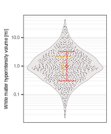
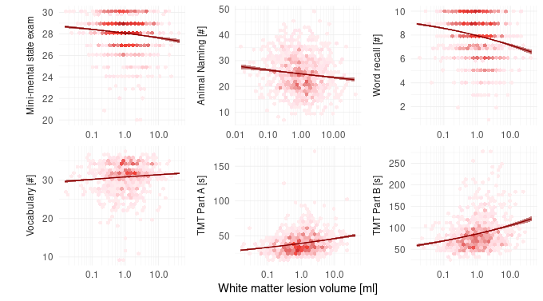
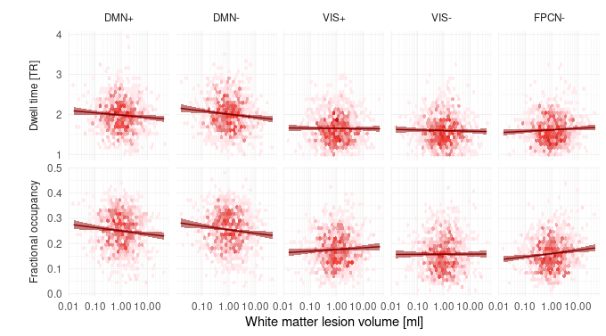
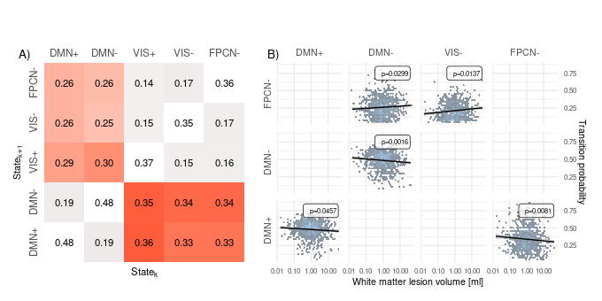

```r
#source('./prepdata.r')
source('loadpackages.r')
load('prepdata.RData')
```


```r
d.struct %>%  Hmisc::describe()
```

```
## . 
## 
##  3  Variables      979  Observations
## --------------------------------------------------------------------------------
## ID 
##        n  missing distinct     Info     Mean      Gmd      .05      .10 
##      979        0      979        1      490    326.7     49.9     98.8 
##      .25      .50      .75      .90      .95 
##    245.5    490.0    734.5    881.2    930.1 
## 
## lowest :   1   2   3   4   5, highest: 975 976 977 978 979
## --------------------------------------------------------------------------------
## WMHsmooth 
##        n  missing distinct     Info     Mean      Gmd      .05      .10 
##      979        0      906        1    1.974    2.355   0.1466   0.2172 
##      .25      .50      .75      .90      .95 
##   0.4642   0.9619   2.1797   4.5723   6.8179 
## 
## lowest :  0.01518750  0.01974375  0.02581875  0.02683125  0.03695625
## highest: 22.52255664 23.74363281 23.96638281 24.57135156 42.45058203
## --------------------------------------------------------------------------------
## psmd 
##         n   missing  distinct      Info      Mean       Gmd       .05       .10 
##       924        55       921         1 0.0002231 4.309e-05 0.0001704 0.0001790 
##       .25       .50       .75       .90       .95 
## 0.0001938 0.0002174 0.0002447 0.0002742 0.0002975 
## 
## lowest : 0.000141715 0.000149023 0.000149217 0.000153270 0.000154609
## highest: 0.000369077 0.000371714 0.000379650 0.000381586 0.000434558
## --------------------------------------------------------------------------------
```


```r
p.preds.all <- lapply(preds.all, function(y){
  d.struct %>% 
  dplyr::select(starts_with(all_of(y))) %>% 
  pivot_longer(cols = y, names_to = 'var', values_to = 'value') %>% 
  ggplot(aes(x = 1, y = value)) +
  geom_violin(fill = 'snow2', size = .1) +
  geom_quasirandom(aes(), alpha = .5, size = .25, stroke = .1) +
  stat_summary(aes(x = 1.05), fun.data = mean_sdl, fun.args = list(mult = 1)
               , geom = "errorbar", color = 'red', width = .2, , size = .25) + 
  stat_summary(aes(x = 1.05), fun = mean, geom = 'point', pch = 23, color = 'red', fill = alpha('snow2',1), , size = 1, stroke = .5) +
  stat_summary(aes(x = .95)
              , fun.min = function(z) { quantile(z,0.25) }
              , fun.max = function(z) { quantile(z,0.75) }
              , fun = median
              , geom = "errorbar", color = 'orange', width = .2, , size = .25) +
  stat_summary(aes(x = .95), fun = median, geom = 'point', pch = 23, color = 'orange', fill = alpha('snow2',1), size = 1, stroke = .5) +
  facet_wrap(~ var, scales = 'fixed', labeller = labeller(var = c(WMHsmooth = ''
                                                                  , WMHsmoothdeep = 'Deep'
                                                                  , WMHsmoothperi = 'Periventricular'))) +
  scale_x_log10('', breaks = NULL, minor_breaks = NULL) +
  scale_y_log10('White matter hyperintensity volume [ml]', breaks = breaks, minor_breaks = minor_breaks, labels = scales::number_format(accuracy = .1)) +
  scale_color_gradient('Age [years]', low = 'blue', high = 'red') +
  #annotation_logticks(scaled = TRUE, sides = 'l') +
  guides(color = guide_colorbar(title.position = 'top')) +
  theme_bw() +
  theme(legend.direction = 'horizontal'
        , legend.position = 'bottom'
        , legend.margin=margin(0,0,0,0)
        , legend.box.margin=margin(-15,0,0,0)
        , legend.text = element_text(size = 5)
        , legend.title = element_text(size = 6)
        , legend.key.height = unit(0.1, 'cm')
        , axis.title = element_text(size = 6)
        , axis.text = element_text(size = 6)
        , strip.background = element_blank()
        , strip.text = element_text(size = 4))
}) %>% setNames(preds.all)

p.preds.all[[1]]
```

<div class="figure" style="text-align: center">

<p class="caption">Fig 1-C</p>
</div>

```r
mapply(function(p, pred){
  ggsave(filename = paste0('./../../derivatives/figures/preddist_', pred, '.png')
                                   , plot = p, device = 'tiff', dpi = 600, width = 5, height = 7.5, units = 'cm')
  }, p.preds.all, preds.all)
```

```
##                                            WMHsmooth 
## "./../../derivatives/figures/preddist_WMHsmooth.png" 
##                                                 psmd 
##      "./../../derivatives/figures/preddist_psmd.png"
```


```r
clindata.unique %>% Hmisc::describe()
```

```
## . 
## 
##  12  Variables      979  Observations
## --------------------------------------------------------------------------------
## ID 
##        n  missing distinct     Info     Mean      Gmd      .05      .10 
##      979        0      979        1      490    326.7     49.9     98.8 
##      .25      .50      .75      .90      .95 
##    245.5    490.0    734.5    881.2    930.1 
## 
## lowest :   1   2   3   4   5, highest: 975 976 977 978 979
## --------------------------------------------------------------------------------
## age 
##        n  missing distinct     Info     Mean      Gmd      .05      .10 
##      979        0       30    0.999    62.54    9.381       48       51 
##      .25      .50      .75      .90      .95 
##       56       64       70       73       74 
## 
## lowest : 46 47 48 49 50, highest: 71 72 73 74 75
## --------------------------------------------------------------------------------
## sex 
##        n  missing distinct 
##      979        0        2 
##                     
## Value         0    1
## Frequency   538  441
## Proportion 0.55 0.45
## --------------------------------------------------------------------------------
## riskgroup_yn 
##        n  missing distinct 
##      974        5        2 
##                             
## Value      0 - nein   1 - ja
## Frequency       682      292
## Proportion      0.7      0.3
## --------------------------------------------------------------------------------
## educationyears 
##        n  missing distinct     Info     Mean      Gmd      .05      .10 
##      954       25       31    0.989    14.22     3.12       11       11 
##      .25      .50      .75      .90      .95 
##       12       13       16       18       19 
## 
## lowest :  5.0  6.0  8.0  9.0 10.0, highest: 20.5 21.0 22.0 23.0 24.0
## --------------------------------------------------------------------------------
## BMI 
##        n  missing distinct     Info     Mean      Gmd      .05      .10 
##      922       57      672        1    26.72     4.85    20.53    21.67 
##      .25      .50      .75      .90      .95 
##    23.54    26.28    29.10    31.97    34.62 
## 
## lowest : 17.27 17.42 18.10 18.29 18.38, highest: 44.62 45.96 45.97 47.19 47.82
## --------------------------------------------------------------------------------
## smoking_yn 
##        n  missing distinct 
##      892       87        3 
##                                   
## Value       active   never stopped
## Frequency      156     298     438
## Proportion   0.175   0.334   0.491
## --------------------------------------------------------------------------------
## diabetes 
##        n  missing distinct 
##      899       80        2 
##                             
## Value      0 - nein   1 - ja
## Frequency       817       82
## Proportion    0.909    0.091
## --------------------------------------------------------------------------------
## hypertension 
##        n  missing distinct 
##      932       47        2 
##                             
## Value      0 - nein   1 - ja
## Frequency       266      666
## Proportion    0.285    0.715
## --------------------------------------------------------------------------------
## psmd 
##         n   missing  distinct      Info      Mean       Gmd       .05       .10 
##       924        55       921         1 0.0002231 4.309e-05 0.0001704 0.0001790 
##       .25       .50       .75       .90       .95 
## 0.0001938 0.0002174 0.0002447 0.0002742 0.0002975 
## 
## lowest : 0.000141715 0.000149023 0.000149217 0.000153270 0.000154609
## highest: 0.000369077 0.000371714 0.000379650 0.000381586 0.000434558
## --------------------------------------------------------------------------------
## cogmeas 
##        n  missing distinct    value 
##      979        0        1     TMTA 
##                
## Value      TMTA
## Frequency   979
## Proportion    1
## --------------------------------------------------------------------------------
## cogvalue 
##        n  missing distinct     Info     Mean      Gmd      .05      .10 
##      831      148       75    0.999    39.26    15.18     22.0     25.0 
##      .25      .50      .75      .90      .95 
##     29.0     36.0     46.0     57.0     64.5 
## 
## lowest :  13  14  17  18  19, highest:  98  99 102 126 172
## --------------------------------------------------------------------------------
```

```r
clindata.unique %>% group_by(sex) %>% summarise(mean(age), sd(age))
```

```
## # A tibble: 2 x 3
##   sex   `mean(age)` `sd(age)`
##   <fct>       <dbl>     <dbl>
## 1 0            63.1      7.98
## 2 1            61.8      8.35
```


Association WMH and CVRFs

```r
lapply(preds.all, function(y){
d.struct %>% 
  merge(clindata.unique) %>%
  dplyr::filter(!!as.symbol(y) > 0) %>% 
  mutate(smoking_yn = if_else(smoking_yn == 'active', 'yes', 'no')) %$% 
  glm(as.formula(paste0(y,'~ I(age/10) + sex + hypertension + diabetes + smoking_yn + BMI')), data = ., family = Gamma(link = 'log')) %$% 
  bind_cols(nobs = nobs(.), tidy(., exponentiate = TRUE, conf.int = TRUE))
  }) %>% setNames(preds.all)
```

```
## $WMHsmooth
## # A tibble: 7 x 8
##    nobs term            estimate std.error statistic  p.value conf.low conf.high
##   <int> <chr>              <dbl>     <dbl>     <dbl>    <dbl>    <dbl>     <dbl>
## 1   758 (Intercept)      0.00526    0.540     -9.72  3.97e-21  0.00173    0.0161
## 2   758 I(age/10)        2.10       0.0677    11.0   4.88e-26  1.83       2.41  
## 3   758 sex1             0.975      0.108     -0.235 8.14e- 1  0.787      1.21  
## 4   758 hypertension1 …  0.960      0.125     -0.324 7.46e- 1  0.749      1.22  
## 5   758 diabetes1 - ja   1.47       0.190      2.03  4.28e- 2  1.03       2.18  
## 6   758 smoking_ynyes    1.30       0.143      1.83  6.84e- 2  0.985      1.74  
## 7   758 BMI              1.04       0.0120     3.40  7.18e- 4  1.02       1.07  
## 
## $psmd
## # A tibble: 7 x 8
##    nobs term            estimate std.error statistic  p.value conf.low conf.high
##   <int> <chr>              <dbl>     <dbl>     <dbl>    <dbl>    <dbl>     <dbl>
## 1   710 (Intercept)     0.000111   0.0559   -163.    0        0.000100  0.000124
## 2   710 I(age/10)       1.11       0.00704    15.3   5.70e-46 1.10      1.13    
## 3   710 sex1            0.962      0.0113     -3.45  5.88e- 4 0.941     0.983   
## 4   710 hypertension1 … 1.03       0.0132      2.24  2.53e- 2 1.00      1.06    
## 5   710 diabetes1 - ja  1.04       0.0204      1.92  5.52e- 2 0.999     1.08    
## 6   710 smoking_ynyes   1.03       0.0150      1.86  6.28e- 2 0.999     1.06    
## 7   710 BMI             1.00       0.00124     0.249 8.03e- 1 0.998     1.00
```


```r
require(mice)
mydata <- d.struct %>% merge(clindata.unique) %>% 
  dplyr::select(WMHsmooth, psmd, age, hypertension, diabetes, smoking_yn, BMI, sex) %>% 
  mutate(smoking_yn = as.factor(if_else(smoking_yn == 'active', 'yes', 'no')))
mydata.mice <- mice(mydata, m = 10)
```

```
## 
##  iter imp variable
##   1   1  psmd  hypertension  diabetes  smoking_yn  BMI
##   1   2  psmd  hypertension  diabetes  smoking_yn  BMI
##   1   3  psmd  hypertension  diabetes  smoking_yn  BMI
##   1   4  psmd  hypertension  diabetes  smoking_yn  BMI
##   1   5  psmd  hypertension  diabetes  smoking_yn  BMI
##   1   6  psmd  hypertension  diabetes  smoking_yn  BMI
##   1   7  psmd  hypertension  diabetes  smoking_yn  BMI
##   1   8  psmd  hypertension  diabetes  smoking_yn  BMI
##   1   9  psmd  hypertension  diabetes  smoking_yn  BMI
##   1   10  psmd  hypertension  diabetes  smoking_yn  BMI
##   2   1  psmd  hypertension  diabetes  smoking_yn  BMI
##   2   2  psmd  hypertension  diabetes  smoking_yn  BMI
##   2   3  psmd  hypertension  diabetes  smoking_yn  BMI
##   2   4  psmd  hypertension  diabetes  smoking_yn  BMI
##   2   5  psmd  hypertension  diabetes  smoking_yn  BMI
##   2   6  psmd  hypertension  diabetes  smoking_yn  BMI
##   2   7  psmd  hypertension  diabetes  smoking_yn  BMI
##   2   8  psmd  hypertension  diabetes  smoking_yn  BMI
##   2   9  psmd  hypertension  diabetes  smoking_yn  BMI
##   2   10  psmd  hypertension  diabetes  smoking_yn  BMI
##   3   1  psmd  hypertension  diabetes  smoking_yn  BMI
##   3   2  psmd  hypertension  diabetes  smoking_yn  BMI
##   3   3  psmd  hypertension  diabetes  smoking_yn  BMI
##   3   4  psmd  hypertension  diabetes  smoking_yn  BMI
##   3   5  psmd  hypertension  diabetes  smoking_yn  BMI
##   3   6  psmd  hypertension  diabetes  smoking_yn  BMI
##   3   7  psmd  hypertension  diabetes  smoking_yn  BMI
##   3   8  psmd  hypertension  diabetes  smoking_yn  BMI
##   3   9  psmd  hypertension  diabetes  smoking_yn  BMI
##   3   10  psmd  hypertension  diabetes  smoking_yn  BMI
##   4   1  psmd  hypertension  diabetes  smoking_yn  BMI
##   4   2  psmd  hypertension  diabetes  smoking_yn  BMI
##   4   3  psmd  hypertension  diabetes  smoking_yn  BMI
##   4   4  psmd  hypertension  diabetes  smoking_yn  BMI
##   4   5  psmd  hypertension  diabetes  smoking_yn  BMI
##   4   6  psmd  hypertension  diabetes  smoking_yn  BMI
##   4   7  psmd  hypertension  diabetes  smoking_yn  BMI
##   4   8  psmd  hypertension  diabetes  smoking_yn  BMI
##   4   9  psmd  hypertension  diabetes  smoking_yn  BMI
##   4   10  psmd  hypertension  diabetes  smoking_yn  BMI
##   5   1  psmd  hypertension  diabetes  smoking_yn  BMI
##   5   2  psmd  hypertension  diabetes  smoking_yn  BMI
##   5   3  psmd  hypertension  diabetes  smoking_yn  BMI
##   5   4  psmd  hypertension  diabetes  smoking_yn  BMI
##   5   5  psmd  hypertension  diabetes  smoking_yn  BMI
##   5   6  psmd  hypertension  diabetes  smoking_yn  BMI
##   5   7  psmd  hypertension  diabetes  smoking_yn  BMI
##   5   8  psmd  hypertension  diabetes  smoking_yn  BMI
##   5   9  psmd  hypertension  diabetes  smoking_yn  BMI
##   5   10  psmd  hypertension  diabetes  smoking_yn  BMI
```

```r
fit <- with(mydata.mice, exp = glm(WMHsmooth ~ I(age/10) + sex + hypertension + diabetes + smoking_yn + BMI, family = Gamma(link = 'log')))
combine <- pool(fit)
summary(combine, conf.int = TRUE, exponentiate = TRUE) %>% 
  as_tibble() 
```

```
## # A tibble: 7 x 8
##   term              estimate std.error statistic    df  p.value `2.5 %` `97.5 %`
##   <fct>                <dbl>     <dbl>     <dbl> <dbl>    <dbl>   <dbl>    <dbl>
## 1 (Intercept)        0.00450    0.463    -11.7    920.  0       0.00181   0.0112
## 2 I(age/10)          2.11       0.0572    13.0    957.  0       1.88      2.36  
## 3 sex1               0.987      0.0907    -0.142  966.  8.87e-1 0.826     1.18  
## 4 hypertension1 - …  0.962      0.110     -0.350  629.  7.27e-1 0.776     1.19  
## 5 diabetes1 - ja     1.41       0.160      2.15   932.  3.20e-2 1.03      1.93  
## 6 smoking_ynyes      1.22       0.119      1.65   929.  9.84e-2 0.964     1.54  
## 7 BMI                1.05       0.0106     4.25   805.  2.43e-5 1.02      1.07
```

```r
fit <- with(mydata.mice, exp = glm(psmd ~ I(age/10) + sex + hypertension + diabetes + smoking_yn + BMI, family = Gamma(link = 'log')))
combine <- pool(fit)
summary(combine, conf.int = TRUE, exponentiate = TRUE) %>% 
  as_tibble()
```

```
## # A tibble: 7 x 8
##   term            estimate std.error statistic    df    p.value `2.5 %` `97.5 %`
##   <fct>              <dbl>     <dbl>     <dbl> <dbl>      <dbl>   <dbl>    <dbl>
## 1 (Intercept)     0.000113   0.0492   -185.     631. 0          1.02e-4 0.000124
## 2 I(age/10)       1.11       0.00600    17.5    856. 0          1.10e+0 1.12    
## 3 sex1            0.955      0.00969    -4.70   672. 0.00000313 9.37e-1 0.974   
## 4 hypertension1 … 1.02       0.0117      1.62   343. 0.106      9.96e-1 1.04    
## 5 diabetes1 - ja  1.04       0.0182      1.89   200. 0.0597     9.99e-1 1.07    
## 6 smoking_ynyes   1.03       0.0126      2.17   686. 0.0306     1.00e+0 1.05    
## 7 BMI             1.00       0.00111     0.631  720. 0.529      9.99e-1 1.00
```


# Cognitive data

```r
clindata %>% group_by(ID) %>% summarise(x = prod(cogvalue)) %>% filter(is.finite(x)) %>% nrow()
```

```
## [1] 673
```

```r
673/979
```

```
## [1] 0.6874362
```

```r
clindata %>% 
  group_by(cogmeas) %>% 
  summarise(sum(is.na(cogvalue))
            , mean(cogvalue, na.rm = TRUE)
            , sd(cogvalue, na.rm = TRUE)
            , q = c(0, .25, .5, .75, 1)
            , quantile(cogvalue, na.rm = TRUE)
            ) %>% 
  dplyr::select(-q) %>% 
  print(n = Inf)
```

```
## # A tibble: 30 x 5
## # Groups:   cogmeas [6]
##    cogmeas  `sum(is.na(cogva… `mean(cogvalue,… `sd(cogvalue, n… `quantile(cogva…
##    <ord>                <int>            <dbl>            <dbl>            <dbl>
##  1 MMST                    53            28.1              1.60             20  
##  2 MMST                    53            28.1              1.60             27  
##  3 MMST                    53            28.1              1.60             28  
##  4 MMST                    53            28.1              1.60             29  
##  5 MMST                    53            28.1              1.60             30  
##  6 animalt…                46            24.9              7.04              7  
##  7 animalt…                46            24.9              7.04             20  
##  8 animalt…                46            24.9              7.04             24  
##  9 animalt…                46            24.9              7.04             30  
## 10 animalt…                46            24.9              7.04             50  
## 11 Recall_…                58             7.93             1.78              1  
## 12 Recall_…                58             7.93             1.78              7  
## 13 Recall_…                58             7.93             1.78              8  
## 14 Recall_…                58             7.93             1.78              9  
## 15 Recall_…                58             7.93             1.78             10  
## 16 Wortsch…               259            30.8              3.92              9  
## 17 Wortsch…               259            30.8              3.92             29  
## 18 Wortsch…               259            30.8              3.92             32  
## 19 Wortsch…               259            30.8              3.92             34  
## 20 Wortsch…               259            30.8              3.92             37  
## 21 TMTA                   148            39.3             14.8              13  
## 22 TMTA                   148            39.3             14.8              29  
## 23 TMTA                   148            39.3             14.8              36  
## 24 TMTA                   148            39.3             14.8              46  
## 25 TMTA                   148            39.3             14.8             172  
## 26 TMTB                   156            86.2             36.9              25  
## 27 TMTB                   156            86.2             36.9              62.5
## 28 TMTB                   156            86.2             36.9              78  
## 29 TMTB                   156            86.2             36.9              99  
## 30 TMTB                   156            86.2             36.9             275
```


## Association between cognitive measures and age

```r
clindata %>% 
  filter(cogmeas %in% c('TMTA', 'TMTB', 'animaltest')) %>% 
  group_by(cogmeas) %>% 
  nest() %>% 
  mutate(mdl = map(data, ~glm(cogvalue ~ I(age/10), family = Gamma(link = 'log'), data = .))
         , tidy = map(mdl, ~tidy(., exponentiate = TRUE, conf.int = TRUE))) %>% 
  unnest(tidy) %>% 
  dplyr::select(-c(data, mdl, std.error, statistic)) %>% 
  print(n=Inf)
```

```
## # A tibble: 6 x 6
## # Groups:   cogmeas [3]
##   cogmeas    term        estimate   p.value conf.low conf.high
##   <ord>      <chr>          <dbl>     <dbl>    <dbl>     <dbl>
## 1 TMTA       (Intercept)   12.9   1.09e-126   10.9      15.4  
## 2 TMTA       I(age/10)      1.19  7.37e- 33    1.16      1.23 
## 3 TMTB       (Intercept)   26.8   2.77e-143   21.9      32.9  
## 4 TMTB       I(age/10)      1.20  5.43e- 27    1.17      1.24 
## 5 animaltest (Intercept)   36.8   8.22e-275   32.1      42.2  
## 6 animaltest I(age/10)      0.939 2.03e-  8    0.919     0.960
```

```r
maxvalues <- c(MMST = 30, Recall_Sumwords = 10, Wortschatz = 37)
clindata %>% filter(cogmeas %in% c('MMST', 'Recall_Sumwords', 'Wortschatz')) %>% 
  group_by(cogmeas) %>% 
  mutate(maxvalue = maxvalues[as.character(cogmeas)]) %>% 
  nest() %>% 
  mutate(mdl = map(data, ~glm(cbind(cogvalue, I(maxvalue-cogvalue)) ~ I(age/10), family = binomial(link = 'logit'), data = ., na.action = na.exclude) )
         , tidy = map(mdl, ~tidy(., exponentiate = TRUE, conf.int = TRUE))) %>% 
  unnest(tidy) %>% 
  dplyr::select(-c(data, mdl, std.error, statistic))
```

```
## # A tibble: 6 x 6
## # Groups:   cogmeas [3]
##   cogmeas         term        estimate  p.value conf.low conf.high
##   <ord>           <chr>          <dbl>    <dbl>    <dbl>     <dbl>
## 1 MMST            (Intercept)   59.8   1.08e-95   40.7      88.2  
## 2 MMST            I(age/10)      0.798 2.13e-13    0.752     0.848
## 3 Recall_Sumwords (Intercept)   75.4   1.10e-88   49.5     116.   
## 4 Recall_Sumwords I(age/10)      0.625 7.53e-45    0.585     0.667
## 5 Wortschatz      (Intercept)    1.63  7.89e- 5    1.28      2.08 
## 6 Wortschatz      I(age/10)      1.20  1.17e-19    1.15      1.25
```

# Model cognitive measures as a function of WMH

```r
m <- lapply(preds.all, function(y){
  c(
    clindata %>% 
      filter(cogmeas %in% c('TMTA', 'TMTB', 'animaltest')) %>% 
      merge(d.struct) %>% 
      dplyr::filter(!!as.symbol(y)>0) %>% 
      group_by(cogmeas) %>%
      nest() %>% 
      mutate(mdl = map(data, ~glm(as.formula(paste0('cogvalue ~ log10(', y, ')')), family = Gamma(link = 'log'), data = .))
             , tidy = map(mdl, ~tidy(., exponentiate = TRUE, conf.int = TRUE))) %$% 
      setNames(as.list(.$mdl), .$cogmeas)
    
  , clindata %>% 
      filter(cogmeas %in% c('MMST', 'Recall_Sumwords', 'Wortschatz')) %>% 
    merge(d.struct) %>% 
    dplyr::filter(!!as.symbol(y)>0) %>% 
    group_by(cogmeas) %>% 
    mutate(maxvalue = maxvalues[as.character(cogmeas)]) %>% 
    nest() %>% 
    mutate(mdl = map(data, ~glm(as.formula(paste0('cbind(cogvalue, I(maxvalue-cogvalue)) ~ log10(', y, ')')), family = binomial(), data = ., na.action = na.exclude))
           , tidy = map(mdl, ~tidy(., exponentiate = TRUE, conf.int = TRUE))) %$% 
    setNames(as.list(.$mdl), .$cogmeas)
  )
}) %>% setNames(preds.all)
```


```r
newWMHsmooth <- lapply(preds.all, function(y){
  seq(min(d.struct[d.struct[y]>0, y], na.rm = TRUE), max(d.struct[y], na.rm = TRUE), length.out = 1000)
}) %>% setNames(preds.all)

newdata <- lapply(preds.all, function(y){
  do.call(rbind,lapply(c('TMTA','TMTB', 'MMST', 'Recall_Sumwords', "animaltest", "Wortschatz")
                  , function(cogmeas){predict(m[[y]][[cogmeas]]
                                              , type = 'response'
                                              , se.fit = TRUE
                                              , newdata = (data.frame(newWMHsmooth[y]) %>% setNames(y))) %>% 
                      as.data.frame() %>% mutate('{y}' := newWMHsmooth[[y]], cogmeas = cogmeas)})
) %>% 
  mutate(fit = case_when(cogmeas == 'MMST' ~ 30*fit
                         , cogmeas == 'Recall_Sumwords' ~ 10*fit
                         , cogmeas == 'Wortschatz' ~ 37*fit
                         , TRUE ~ fit)
         , se.fit = case_when(cogmeas == 'MMST' ~ 30*se.fit
                              , cogmeas == 'Recall_Sumwords' ~ 10*se.fit
                              , cogmeas == 'Wortschatz' ~ 37*se.fit
                              , TRUE ~ se.fit)) %>% 
    mutate(cogmeas = factor(cogmeas, levels = c('MMST','animaltest','Recall_Sumwords','Wortschatz','TMTA','TMTB'), ordered = TRUE))
}) %>% 
  setNames(preds.all)


p.preds.all.cog <- lapply(preds.all, function(y){

clindata %>% 
  merge(d.struct) %>% ungroup() %>% 
  arrange(!!as.symbol(y)) %>% 
  ggplot(aes_(x = as.name(y), y = quote(cogvalue))) +
  geom_hex() + guides(fill = FALSE) + 
  geom_line(data = newdata[[y]]
            , aes_(x = as.name(y), y = quote(fit)), inherit.aes = FALSE, color = 'darkred') +
  geom_ribbon(data = newdata[[y]]
              , aes_(x = as.name(y), ymax = quote(fit + se.fit), ymin = quote(fit - se.fit)), inherit.aes = FALSE, fill = 'darkred', alpha = .5) +
    facet_wrap(~cogmeas, scales = 'free', strip.position = 'left'
             , labeller = labeller(cogmeas = c('MMST' = 'Mini-mental state exam'
                                  , 'Recall_Sumwords' = 'Word recall [#]'
                                  , 'TMTA' = 'TMT Part A [s]'
                                  , 'TMTB' = 'TMT Part B [s]'
                                  , 'Wortschatz' = 'Vocabulary [#]'
                                  , 'animaltest'= 'Animal Naming [#]'))) +
  #scale_x_log10(if_else(stringr::str_starts(y,'WMH'),'White matter lesion volume [ml]', 'PSMD'), breaks = scales::pretty_breaks(2), labels = scales::number_format(accuracy = 0.0001)) +
  scale_x_log10(if_else(stringr::str_starts(y,'WMH'),'White matter lesion volume [ml]', 'PSMD'), breaks = breaks, minor_breaks = minor_breaks) +
  scale_y_continuous('', breaks = scales::pretty_breaks(4)) +
  scale_fill_material() +
  theme_minimal() +
  theme(strip.placement = 'outside'
        , panel.grid = element_line(size = .25))
}) %>% setNames(preds.all)


p.preds.all.cog[[1]]
```

<div class="figure" style="text-align: center">

<p class="caption">Fig 2</p>
</div>

```r
mapply(function(p, pred){ggsave(filename = paste0('./../../derivatives/figures/predcog_', pred, '.png')
                                   , plot = p, device = 'png', dpi = 600, width = 18, height = 10, units = 'cm')}, p.preds.all.cog, preds.all)
```

```
##                                           WMHsmooth 
## "./../../derivatives/figures/predcog_WMHsmooth.png" 
##                                                psmd 
##      "./../../derivatives/figures/predcog_psmd.png"
```


```r
mm <- lapply(preds.all, function(y){
bind_rows(

clindata %>% filter(cogmeas %in% c('TMTA', 'TMTB', 'animaltest')) %>% 
  merge(d.struct) %>% 
  dplyr::filter(!!as.symbol(y)>0) %>% 
  group_by(cogmeas) %>% 
  mutate(yy = log(!!as.symbol(y), base = quantile(!!as.symbol(y),.75)/quantile(!!as.symbol(y),.25))) %>% 
  nest() %>% 
  mutate(mdl = map(data, ~glm(cogvalue ~ yy + age + sex, family = Gamma(link = 'log'), data = ., na.action = na.exclude))
         , tidy = map(mdl, ~tidy(., exponentiate = TRUE, conf.int = TRUE))) %>% 
  unnest(tidy) %>% 
  dplyr::select(-data, -mdl, -std.error, -statistic) %>% 
  dplyr::filter(term == 'yy')

, clindata %>% filter(cogmeas %in% c('MMST', 'Recall_Sumwords', 'Wortschatz')) %>% 
  merge(d.struct) %>% 
  dplyr::filter(!!as.symbol(y)>0) %>% 
  group_by(cogmeas) %>% 
  mutate(maxvalue = maxvalues[as.character(cogmeas)]) %>% 
  mutate(yy = log(!!as.symbol(y), base = quantile(!!as.symbol(y),.75)/quantile(!!as.symbol(y),.25))) %>% 
  nest() %>% 
  mutate(mdl = map(data, ~glm(cbind(cogvalue, I(maxvalue-cogvalue)) ~ yy + age + sex, family = binomial(), data = ., na.action = na.exclude) )
         , tidy = map(mdl, ~tidy(., exponentiate = TRUE, conf.int = TRUE))) %>% 
  unnest(tidy) %>% 
  dplyr::select(-data, -mdl, -std.error, -statistic) %>% 
  dplyr::filter(term == 'yy')
) })  %>% setNames(preds.all) 
mm
```

```
## $WMHsmooth
## # A tibble: 6 x 6
## # Groups:   cogmeas [6]
##   cogmeas         term  estimate p.value conf.low conf.high
##   <ord>           <chr>    <dbl>   <dbl>    <dbl>     <dbl>
## 1 TMTA            yy       1.02  0.242      0.986      1.06
## 2 TMTB            yy       1.06  0.00747    1.01       1.10
## 3 animaltest      yy       0.992 0.576      0.966      1.02
## 4 MMST            yy       0.962 0.283      0.896      1.03
## 5 Recall_Sumwords yy       0.934 0.0778     0.866      1.01
## 6 Wortschatz      yy       0.976 0.326      0.930      1.02
## 
## $psmd
## # A tibble: 6 x 6
## # Groups:   cogmeas [6]
##   cogmeas         term  estimate p.value conf.low conf.high
##   <ord>           <chr>    <dbl>   <dbl>    <dbl>     <dbl>
## 1 TMTA            yy       1.04  0.0724     0.998      1.08
## 2 TMTB            yy       1.07  0.00322    1.02       1.12
## 3 animaltest      yy       0.981 0.216      0.951      1.01
## 4 MMST            yy       1.06  0.155      0.978      1.15
## 5 Recall_Sumwords yy       0.946 0.208      0.867      1.03
## 6 Wortschatz      yy       1.10  0.00217    1.03       1.16
```

```r
mm$WMHsmooth$p.value %>% p.adjust(method = 'holm')
```

```
## [1] 0.96714111 0.04483504 0.96714111 0.96714111 0.38924360 0.96714111
```


# Structure-Function relation

```r
p <- c()
p <- lm(switchrate ~ log(WMHsmooth, 4.695202), data = df.mean) %>% 
  tidy(conf.int = TRUE)%T>% print() %>% 
  pull('p.value') %>% .[[2]]%>% 
  prepend(p)
```

```
## # A tibble: 2 x 7
##   term                   estimate std.error statistic p.value conf.low conf.high
##   <chr>                     <dbl>     <dbl>     <dbl>   <dbl>    <dbl>     <dbl>
## 1 (Intercept)              67.6       0.180    375.   0         67.2       67.9 
## 2 log(WMHsmooth, 4.6952…    0.644     0.235      2.74 0.00620    0.183      1.10
```

```r
p <- lm(meandwelltime ~ log(WMHsmooth, 4.695202), data = df.mean) %>% 
  tidy(conf.int = TRUE)%T>% print() %>% 
  pull('p.value') %>% .[[2]]%>% 
  prepend(p)
```

```
## # A tibble: 2 x 7
##   term                   estimate std.error statistic p.value conf.low conf.high
##   <chr>                     <dbl>     <dbl>     <dbl>   <dbl>    <dbl>     <dbl>
## 1 (Intercept)              1.85     0.00505    365.    0        1.84     1.86   
## 2 log(WMHsmooth, 4.6952…  -0.0166   0.00659     -2.52  0.0119  -0.0295  -0.00367
```

```r
p <- lm(switchrate ~ log(psmd, 1.262355), data = df.mean) %>% 
  tidy(conf.int = TRUE) %T>% print() %>% 
  pull('p.value') %>% .[[2]] %>% 
  prepend(p)
```

```
## # A tibble: 2 x 7
##   term                estimate std.error statistic  p.value conf.low conf.high
##   <chr>                  <dbl>     <dbl>     <dbl>    <dbl>    <dbl>     <dbl>
## 1 (Intercept)           87.3       9.36       9.33 7.35e-20  69.0       106.  
## 2 log(psmd, 1.262355)    0.549     0.259      2.12 3.42e- 2   0.0409      1.06
```

```r
p <- lm(meandwelltime ~ log(psmd, 1.262355), data = df.mean) %>% 
  tidy(conf.int = TRUE)%T>% print() %>% 
  pull('p.value') %>% .[[2]]%>% 
  prepend(p)
```

```
## # A tibble: 2 x 7
##   term                estimate std.error statistic    p.value conf.low conf.high
##   <chr>                  <dbl>     <dbl>     <dbl>      <dbl>    <dbl>     <dbl>
## 1 (Intercept)           1.30     0.263        4.94    9.13e-7   0.784   1.82    
## 2 log(psmd, 1.262355)  -0.0151   0.00727     -2.08    3.76e-2  -0.0294 -0.000870
```

```r
p
```

```
## [1] 0.006204278 0.011930712 0.034205913 0.037609320
```

```r
p %>% p.adjust(method = 'holm')
```

```
## [1] 0.02481711 0.03579214 0.06841183 0.06841183
```


```r
dd %>% 
  group_by(meas, state) %>% 
  summarise(mean(value), sd(value)) %>% 
  arrange(meas, state)
```

```
## # A tibble: 10 x 4
## # Groups:   meas [2]
##    meas    state `mean(value)` `sd(value)`
##    <ord>   <fct>         <dbl>       <dbl>
##  1 fracocc VIS+          0.176      0.0667
##  2 fracocc FPCN-         0.160      0.0621
##  3 fracocc VIS-          0.158      0.0699
##  4 fracocc DMN-          0.255      0.0720
##  5 fracocc DMN+          0.251      0.0715
##  6 dwell   VIS+          1.65       0.358 
##  7 dwell   FPCN-         1.62       0.344 
##  8 dwell   VIS-          1.60       0.357 
##  9 dwell   DMN-          2.01       0.413 
## 10 dwell   DMN+          1.98       0.396
```


```r
lapply(preds.all, function(y){
dd %>% merge(d.struct) %>% 
  mutate(state = factor(state, levels = c('DMN+','DMN-', 'VIS+', 'VIS-','FPCN-'), ordered = TRUE)) %>% 
  ggplot(aes_(x = as.name(y), y = quote(value))) +
  geom_hex() +
  geom_smooth(method = 'lm', color = 'darkred', fill = 'darkred') +
  facet_grid(meas ~ state, scales = 'free'
             , switch = 'y'
             , labeller = labeller(meas = c('fracocc' = 'Fractional occupancy', 'dwell' = 'Dwell time [TR]'))) +
  guides(fill = FALSE) +
  scale_x_log10(if_else(stringr::str_starts(y,'WMH'),'White matter lesion volume [ml]', 'PSMD'), breaks = scales::pretty_breaks(2), labels = scales::number_format(accuracy = 0.0001)) +
  #scale_x_log10('White matter leson volume [ml]', labels = scales::number_format(accuracy = .01), breaks = breaks, minor_breaks = minor_breaks) +
  annotation_logticks(scaled = TRUE, sides = '') +
  scale_y_continuous('') +
  scale_fill_material() +
  theme_minimal() +
  theme(strip.background = element_blank()
        , strip.placement = "outside"
        , panel.grid = element_line(size = .25))
}) %>% setNames(preds.all) %>% 
  (function(x){mapply(function(a,b)ggsave(filename = paste0('./../../derivatives/figures/WMHtvFC_', b, '_', design, '.png')
                                          , plot = a
                                          , device = 'png', width = 18, height = 10, units = 'cm'
                                          , dpi = 600)
                      , x, names(x), USE.NAMES = FALSE, SIMPLIFY = TRUE)})
```

```
## [1] "./../../derivatives/figures/WMHtvFC_WMHsmooth_36p.png"
## [2] "./../../derivatives/figures/WMHtvFC_psmd_36p.png"
```


```r
lapply(preds.all, function(y){
dd %>% 
  merge(clindata.unique) %>%  
  group_by(meas, state) %>% 
    dplyr::filter(!!as.symbol(y)>0) %>% 
  mutate(q1 = quantile(!!as.symbol(y), prob=c(.75))
         , q3 = quantile(!!as.symbol(y), prob=c(.25))
         , ytrans = log(!!as.symbol(y), q1/q3)) %>% 
  nest() %>% 
  mutate(mdl = map(data, ~lm(value ~ ytrans + age + sex, data = .))
         , tidy = map(mdl, tidy)) %>% 
  unnest(tidy) %>% 
  filter(p.value < 0.1 & term == 'ytrans')
}) %>% setNames(preds.all)
```

```
## $WMHsmooth
## # A tibble: 5 x 9
## # Groups:   meas, state [5]
##   meas    state data           mdl    term  estimate std.error statistic p.value
##   <ord>   <fct> <list>         <list> <chr>    <dbl>     <dbl>     <dbl>   <dbl>
## 1 dwell   DMN-  <tibble [979 … <lm>   ytra… -0.0596    0.0196      -3.04 2.44e-3
## 2 fracocc FPCN- <tibble [979 … <lm>   ytra…  0.00996   0.00295      3.37 7.68e-4
## 3 fracocc DMN-  <tibble [979 … <lm>   ytra… -0.00837   0.00342     -2.45 1.46e-2
## 4 fracocc DMN+  <tibble [979 … <lm>   ytra… -0.00754   0.00340     -2.22 2.69e-2
## 5 dwell   DMN+  <tibble [979 … <lm>   ytra… -0.0329    0.0189      -1.74 8.14e-2
## 
## $psmd
## # A tibble: 5 x 9
## # Groups:   meas, state [5]
##   meas    state data            mdl   term  estimate std.error statistic p.value
##   <ord>   <fct> <list>          <lis> <chr>    <dbl>     <dbl>     <dbl>   <dbl>
## 1 dwell   DMN-  <tibble [924 ×… <lm>  ytra… -0.0549    0.0230      -2.39 0.0171 
## 2 fracocc FPCN- <tibble [924 ×… <lm>  ytra…  0.00900   0.00343      2.62 0.00884
## 3 fracocc DMN-  <tibble [924 ×… <lm>  ytra… -0.00820   0.00398     -2.06 0.0397 
## 4 fracocc DMN+  <tibble [924 ×… <lm>  ytra… -0.00762   0.00396     -1.92 0.0548 
## 5 dwell   DMN+  <tibble [924 ×… <lm>  ytra… -0.0375    0.0220      -1.70 0.0894
```


```r
lapply(preds.all, function(y){
dd %>% 
  merge(clindata.unique) %>%  
  group_by(meas, state) %>% 
  dplyr::filter(meas == 'fracocc') %>% 
  dplyr::filter(!!as.symbol(y)>0) %>% 
  mutate(q1 = quantile(!!as.symbol(y), prob=c(.75))
         , q3 = quantile(!!as.symbol(y), prob=c(.25))
         , ytrans = log(!!as.symbol(y), q1/q3)) %>% 
  nest() %>% 
  mutate(mdl = map(data, ~betareg(value ~ ytrans + age + sex, data = ., link = 'logit', link.phi = 'log'))
         , tidy = map(mdl, ~tidy(., exponentiate = TRUE, conf.int = TRUE))) %>% 
  unnest(tidy) %>% mutate(across(c(estimate, starts_with('conf')), exp)) %>% 
  filter(p.value < 0.1 & term == 'ytrans')
}) %>% setNames(preds.all)
```

```
## $WMHsmooth
## # A tibble: 3 x 12
## # Groups:   meas, state [3]
##   meas   state data   mdl   component term  estimate std.error statistic p.value
##   <ord>  <fct> <list> <lis> <chr>     <chr>    <dbl>     <dbl>     <dbl>   <dbl>
## 1 fraco… FPCN- <tibb… <bet… mean      ytra…    1.07     0.0217      3.29 9.90e-4
## 2 fraco… DMN-  <tibb… <bet… mean      ytra…    0.947    0.0187     -2.91 3.60e-3
## 3 fraco… DMN+  <tibb… <bet… mean      ytra…    0.953    0.0189     -2.55 1.08e-2
## # … with 2 more variables: conf.low <dbl>, conf.high <dbl>
## 
## $psmd
## # A tibble: 3 x 12
## # Groups:   meas, state [3]
##   meas   state data   mdl   component term  estimate std.error statistic p.value
##   <ord>  <fct> <list> <lis> <chr>     <chr>    <dbl>     <dbl>     <dbl>   <dbl>
## 1 fraco… FPCN- <tibb… <bet… mean      ytra…    1.07     0.0252      2.56  0.0105
## 2 fraco… DMN-  <tibb… <bet… mean      ytra…    0.948    0.0217     -2.45  0.0144
## 3 fraco… DMN+  <tibb… <bet… mean      ytra…    0.956    0.0220     -2.07  0.0389
## # … with 2 more variables: conf.low <dbl>, conf.high <dbl>
```

```r
lapply(preds.all, function(y){
dd %>% 
  merge(clindata.unique) %>%  
  group_by(meas, state) %>% 
  dplyr::filter(meas == 'dwell') %>% 
  dplyr::filter(!!as.symbol(y)>0) %>% 
  mutate(q1 = quantile(!!as.symbol(y), prob=c(.75))
         , q3 = quantile(!!as.symbol(y), prob=c(.25))
         , ytrans = log(!!as.symbol(y), q1/q3)) %>% 
  nest() %>% 
  mutate(mdl = map(data, ~glm(value ~ ytrans + age + sex, data = ., family = Gamma(link = 'log')))
         , tidy = map(mdl, ~tidy(., exponentiate = TRUE))) %>% 
  unnest(tidy) %>% 
  filter(p.value < 0.1 & term == 'ytrans')
}) %>% setNames(preds.all)
```

```
## $WMHsmooth
## # A tibble: 2 x 9
## # Groups:   meas, state [2]
##   meas  state data             mdl    term  estimate std.error statistic p.value
##   <ord> <fct> <list>           <list> <chr>    <dbl>     <dbl>     <dbl>   <dbl>
## 1 dwell DMN-  <tibble [979 × … <glm>  ytra…    0.970   0.00979     -3.10 0.00199
## 2 dwell DMN+  <tibble [979 × … <glm>  ytra…    0.983   0.00952     -1.77 0.0776 
## 
## $psmd
## # A tibble: 2 x 9
## # Groups:   meas, state [2]
##   meas  state data             mdl    term  estimate std.error statistic p.value
##   <ord> <fct> <list>           <list> <chr>    <dbl>     <dbl>     <dbl>   <dbl>
## 1 dwell DMN-  <tibble [924 × … <glm>  ytra…    0.972    0.0114     -2.44  0.0149
## 2 dwell DMN+  <tibble [924 × … <glm>  ytra…    0.981    0.0111     -1.73  0.0846
```

```r
ynew <- seq(from = min(d.struct$WMHsmooth), to = max(d.struct$WMHsmooth), length.out = 1e4)

eff.beta <- data.frame()
for( s in unique(dd$state) ){
  temp.data <- dd %>% 
    merge(clindata.unique) %>%  
    dplyr::filter(meas == 'fracocc' & state == s) %>% 
    dplyr::filter(WMHsmooth>0)
  m <- betareg(value ~ log10(WMHsmooth), data = temp.data, link = 'logit', link.phi = 'log')
  eff.beta <- eff.beta %>% bind_rows(allEffects(m, xlevels = list(WMHsmooth = ynew))$`log10(WMHsmooth)` %>% 
      as.data.frame() %>% as_tibble() %>% mutate(state = s, meas = 'fracocc')
  )
}

eff.gamma <- data.frame()
for( s in unique(dd$state) ){
  temp.data <- dd %>% 
    merge(clindata.unique) %>%  
    dplyr::filter(meas == 'dwell' & state == s) %>% 
    dplyr::filter(WMHsmooth>0)
  m <- glm(value ~ log10(WMHsmooth), data = temp.data, family = Gamma(link = 'log'))
  eff.gamma <- eff.gamma %>% bind_rows(allEffects(m, xlevels = list(WMHsmooth = ynew))$`log10(WMHsmooth)` %>% 
      as.data.frame() %>% as_tibble() %>% mutate(state = s, meas = 'dwell')
  )
}

eff <- bind_rows(eff.beta, eff.gamma) %>% 
  mutate(state = factor(state, levels = c('DMN+','DMN-', 'VIS+', 'VIS-','FPCN-'), ordered = TRUE))

dd %>% 
  merge(clindata.unique) %>%  
  mutate(state = factor(state, levels = c('DMN+','DMN-', 'VIS+', 'VIS-','FPCN-'), ordered = TRUE)) %>% 
  dplyr::filter(WMHsmooth>0) %>% 
  ggplot(aes(x = WMHsmooth, y = value)) +
  geom_hex() +
  geom_line(data = eff, aes(x = WMHsmooth, y = fit), inherit.aes = FALSE, color = 'darkred') +
  geom_ribbon(data = eff, aes(y = fit, ymin = lower, ymax = upper), alpha = .5, fill = 'darkred') +
  facet_grid(meas ~ state, scales = 'free'
             , switch = 'y'
             , labeller = labeller(meas = c('fracocc' = 'Fractional occupancy', 'dwell' = 'Dwell time [TR]'))) +
  guides(fill = 'none') +
  scale_x_log10('White matter lesion volume [ml]', labels = scales::number_format(accuracy = .01), breaks = breaks, minor_breaks = minor_breaks) +
  annotation_logticks(scaled = TRUE, sides = '') +
  scale_y_continuous('') +
  scale_fill_material() +
  theme_minimal() +
  theme(strip.background = element_blank()
        , strip.placement = "outside"
        , panel.grid = element_line(size = .25))
```



```r
ggsave(filename = paste0('./../../derivatives/figures/WMHtvFC_WMHsmooth_beta_', design, '.tiff')
                                          , plot = last_plot()
                                          , device = 'tiff', width = 18, height = 10, units = 'cm'
                                          , dpi = 600)
```


# Model cognitive measures as a function of brain dynamics

```r
df.mean %>% 
  filter(cogmeas %in% c('TMTA', 'TMTB', 'animaltest')) %>%
  group_by(cogmeas) %>% nest() %>% 
  mutate(mdl = map(data, ~glm(cogvalue ~ switchrate + age + sex + educationyears + log10(WMHsmooth), family = Gamma(link = 'log'), data = .))
         , tidy = map(mdl, ~tidy(., exponentiate = TRUE, conf.int = TRUE))) %>% 
  unnest(tidy)
```

```
## # A tibble: 6 x 10
## # Groups:   cogmeas [1]
##   cogmeas data      mdl   term    estimate std.error statistic  p.value conf.low
##   <ord>   <list>    <lis> <chr>      <dbl>     <dbl>     <dbl>    <dbl>    <dbl>
## 1 TMTA    <tibble … <glm> (Inter…   15.9     0.188      14.7   1.23e-43   11.1  
## 2 TMTA    <tibble … <glm> switch…    1.00    0.00206     0.121 9.03e- 1    0.996
## 3 TMTA    <tibble … <glm> age        1.02    0.00163    10.0   2.14e-22    1.01 
## 4 TMTA    <tibble … <glm> sex1       0.981   0.0236     -0.822 4.11e- 1    0.937
## 5 TMTA    <tibble … <glm> educat…    0.990   0.00428    -2.26  2.41e- 2    0.982
## 6 TMTA    <tibble … <glm> log10(…    1.02    0.0262      0.846 3.98e- 1    0.971
## # … with 1 more variable: conf.high <dbl>
```


```r
clindata %>% 
  merge(dd) %>% 
  filter(cogmeas %in% c('TMTA', 'TMTB', 'animaltest')) %>% 
  dplyr::filter(WMHsmooth>0) %>% 
  group_by(cogmeas, meas, state) %>% 
  nest() %>% 
  mutate(mdl = map(data, ~glm(as.formula(paste0('cogvalue ~ value + age + sex + educationyears + log10(WMHsmooth)')), family = Gamma(link = 'log'), data = .))
         , tidy = map(mdl, ~tidy(., exponentiate = TRUE, conf.int = TRUE))) %>% 
  unnest(tidy) %>% 
  dplyr::select(-c(data, mdl, std.error)) %>% 
  dplyr::filter(term == 'value' & p.value < 0.05)
```

```
## # A tibble: 3 x 9
## # Groups:   cogmeas, meas, state [3]
##   cogmeas meas    state term  estimate statistic p.value conf.low conf.high
##   <ord>   <ord>   <fct> <chr>    <dbl>     <dbl>   <dbl>    <dbl>     <dbl>
## 1 TMTB    dwell   VIS-  value    1.08       1.98 0.0478     1.00       1.16
## 2 TMTB    fracocc VIS-  value    1.67       2.75 0.00616    1.16       2.40
## 3 TMTB    dwell   DMN+  value    0.936     -1.98 0.0477     0.876      1.00
```

```r
clindata %>% 
  merge(dd) %>% 
  filter(cogmeas %in% c('MMST', 'Recall_Sumwords', 'Wortschatz')) %>% 
  merge(d.struct) %>% 
  dplyr::filter(WMHsmooth>0) %>% 
  group_by(cogmeas) %>% 
  mutate(maxvalue = maxvalues[as.character(cogmeas)]) %>% 
  nest() %>% 
  mutate(mdl = map(data, ~glm(as.formula(paste0('cbind(cogvalue, I(maxvalue-cogvalue)) ~ value + log10(WMHsmooth)')), family = binomial(), data = ., na.action = na.exclude))
         , tidy = map(mdl, ~tidy(., exponentiate = TRUE, conf.int = TRUE))) %>% 
  unnest(tidy) %>% 
  dplyr::filter(term == 'value' & p.value < 0.05)
```

```
## # A tibble: 0 x 10
## # Groups:   cogmeas [0]
## # … with 10 variables: cogmeas <ord>, data <list>, mdl <list>, term <chr>,
## #   estimate <dbl>, std.error <dbl>, statistic <dbl>, p.value <dbl>,
## #   conf.low <dbl>, conf.high <dbl>
```

# Transition probabilities

```r
p.TP <- TP.data %>% 
group_by(state_in, state_out) %>% 
  summarise(prob = mean(prob, na.rm = TRUE)) %>% 
  mutate(lab = scales::number_format(accuracy = .01)(prob)) %>% 
  mutate(fillcol = if_else(state_in!=state_out, prob, 0)) %>% 
  filter(!is.na(state_in)) %>% 
  ggplot(aes(x = state_in, y = state_out, fill = fillcol)) +
  geom_tile() +
  geom_text(aes(label = lab), size = 3) +
  coord_equal(clip = 'off') +
  geom_text(data=~.x[1,], label=expression('State'[k]), x=3, y=.25, inherit.aes = FALSE, size = 3) +
  scale_x_discrete('', expand = expansion(0,0), position = 'top') +
  scale_y_discrete(expression('State'[k+1]), expand = expansion(0,0)) +
  scale_fill_gradient2('Transition probability', low="white", high="red", mid = 'snow2', midpoint = 0.2) +
  guides(fill = 'none') +
  theme_minimal() +
  theme(panel.grid = element_blank()
        , legend.position = 'bottom'
        , legend.spacing.x = unit(0, 'cm')
        , axis.text.y = element_text(angle = 90)) 
```


```r
p.TP.reg <- TP.data %>% 
  merge(clindata.unique) %>% 
  merge(d.struct) %>% 
  filter(prob > 0 & prob < 1) %>% 
  #filter(state_in < state_out) %>%
  group_by(state_in, state_out) %>% 
  nest() %>% 
  mutate(mdl = map(data, ~betareg(prob ~ log10(WMHsmooth) + age + sex, data = .))
         , tidy = map(mdl, tidy)) %>% 
  unnest(tidy) %>% 
  filter(term == 'log10(WMHsmooth)' & p.value < 0.05) %>% 
  left_join(TP.data) %>% 
  left_join(d.struct) %>% 
  filter(prob > 0 & prob < 1) %>% 
  mutate(state_out = forcats::fct_rev(state_out)) %>% 
  ggplot(aes(x = WMHsmooth, y=prob)) +
  geom_hex(alpha = .5) +
  geom_smooth(method = 'lm', color = 'black', size = .5) +
  geom_label(data = ~dplyr::select(., c(state_in, state_out, p.value)) %>% unique(), aes(label = sprintf('p=%1.4f', p.value)), x=1.6, hjust=1, y=.75, size = 2, alpha = .75, inherit.aes = FALSE) +
  facet_grid(state_out ~ state_in, switch = 'y', ) +
  scale_x_continuous('White matter lesion volume [ml]', trans = 'log10', breaks = breaks, minor_breaks = NULL) +
  scale_y_continuous('Transition probability', position = 'right') +
  guides(fill = 'none') +
  theme_minimal() +
  theme(strip.background = element_blank()
        , strip.text = element_text(color = gray.colors(3)[1], size = 8)
        , axis.text = element_text(size = 6))

p.TP + p.TP.reg + plot_annotation(tag_levels = 'A', tag_suffix = ')') &  
  theme(plot.tag.position  = c(.05, .85), plot.tag = element_text(size = 10)
        , axis.text.y = element_text(hjust = .5)
        , axis.text = element_text(color = gray.colors(3)[1])
        , axis.title = element_text(size = 8))
```

<div class="figure" style="text-align: center">

<p class="caption">Fig 5</p>
</div>

```r
ggsave('./../../derivatives/figures/TPplot.png', device = 'png', width = 18, height = 9, units = 'cm', dpi = 600)

image_read('./../../derivatives/figures/TPplot.png') %>% 
  image_trim() %>% 
  image_write('./../../derivatives/figures/TPplot.png')
```
